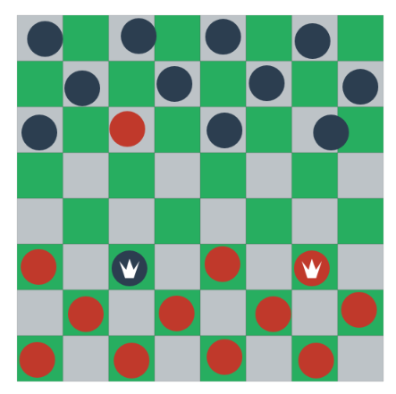

MMO Checkers Table
===



### install
```
npm install
```

**Note**: If you're new to node, check the [original tutorial](http://rawkes.com/articles/creating-a-real-time-multiplayer-game-with-websockets-and-node.html).


### development
```
npm run dev
```
